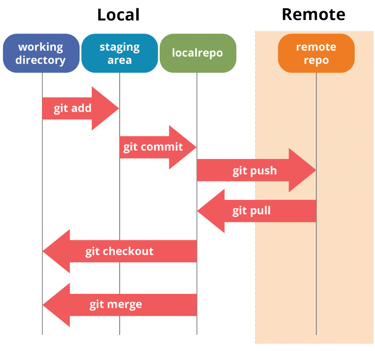
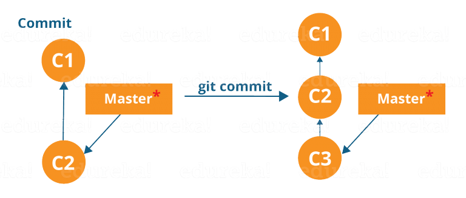
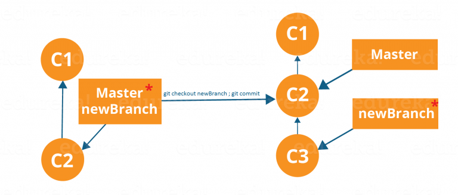
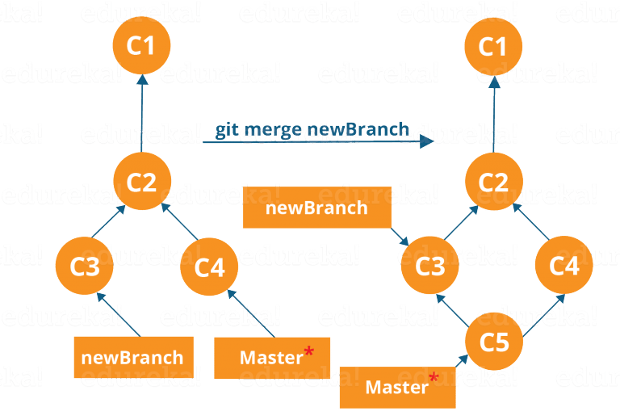
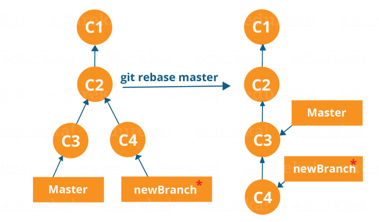
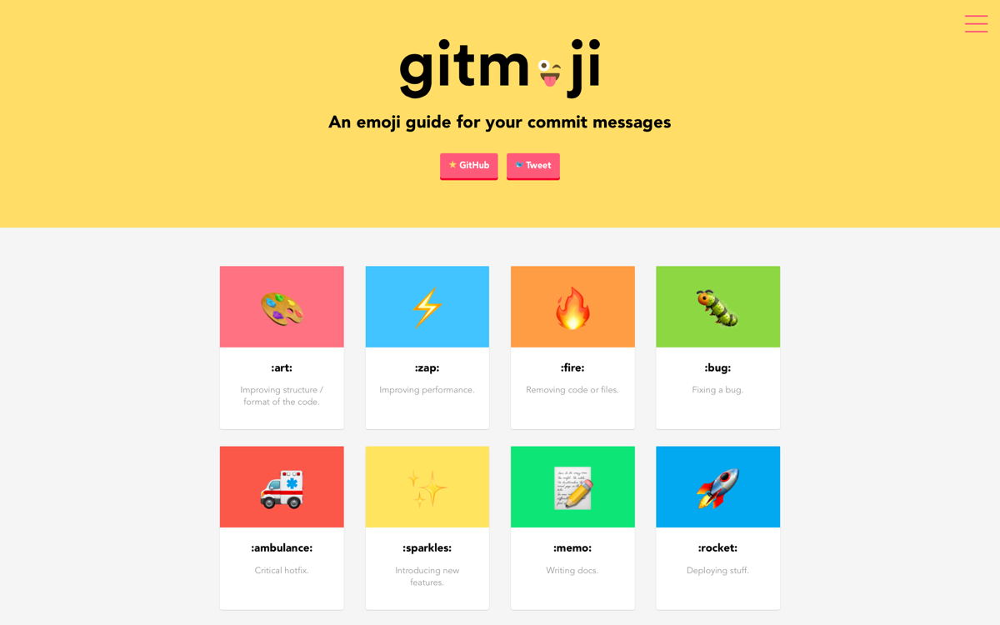

# Get started with git

---

<!-- _class: invert -->

# Intro

- ist kostenfrei
- open source distributed vcs
- für kleine und große Projekte

---

<!-- _class: invert -->

# Wir lernen heute

- Kommandos
- Operationen
- Praktische Anwendung

---

<!-- _class: invert -->

# Motiv für git

Das Ziel von Git ist es, ein Projekt oder eine Reihe von Dateien zu verwalten, während sie sich im Laufe der Zeit ändern. Git speichert diese Informationen in einer Datenstruktur, die als Git-Repository bezeichnet wird. Das Repository ist das Herzstück von Git.

---

<!-- _class: invert -->

# Motiv für git

- Git-Repository ist ein Verzeichnis, in dem alle Meta-Daten zu einem Projekt gespeichert werden.
- Git speichert den Zustand in einem Directed Acyclic Graph (DAG)

---

<!-- _class: invert -->

# Basic Operations

1. Initilize
2. Add
3. Commit
4. Pull
5. Push

---

<!-- _class: invert -->

# Advanced Git Operations

- Branching
- Merging
- Rebasing

---



---

<!-- _class: invert -->

# Git installieren

```shell
PS C:\Users\arctic> choco search git
Chocolatey v1.1.0
git 2.36.0 [Approved]
PS C:\Users\arctic> gsudo choco install git
```

```shell
PS C:\Users\arctic> git --version
git version 2.36.0.windows.1
```

---

<!-- _class: invert -->

# Alternativ web

[Web-win](https://git-scm.com/download/win)
[Web-mac](https://git-scm.com/download/mac)

---

<!-- _class: invert -->

# Jetzt gehts los

---

<!-- _class: invert -->

# Initilize

```shell
PS C:\Users\arctic\git-tutorial> git init
Initialized empty Git repository in C:/Users/arctic/git-tutorial/.git/
```

:tada: Wir haben unser git repository erstellt

---

<!-- _class: invert -->

# Initilize

`git init` erstellt ein leeres git repository oder re-initialisiert ein bereits vorhandenes. Es erstellt einfach ein `.git` Verzeichnes mit allen relevanten Informationen.

**Es werden keine Daten überschrieben, nur das Template aktualisiert**

---

<!-- _class: invert -->

# Status

`git status`

- zeigt alle modifizierten Dateien
- zeigt alle neuen Dateien
- zeigt alle gelöschten Dateien

---

<!-- _class: invert -->

# Add

`git add`

- fügt eine Datei oder Ordner zum Commit hinzu
- updated den Index mit den neuen Informationen

Also **bevor** man den _working tree_ ändern kann, muss man den **add** Kommand ausführen.

---

<!-- _class: invert -->

# Commit

- refereiert dazu einen Schnappschuss zu erstellen zu einer gewissen Zeit
- etwas das committed wurde wird nicht mehr geändert (außer explizit angefordert)

---

# Commit



<!--
Erklärung:

1. C1 - initialer commit
2. C2 - commit mit neuen Dateien
3. Jetzt fügen wir neue Änderungen hinzu
4. C3 - commit mit neuen Dateien

C3 ist am Ende der HEAD

Git versucht, Commits so einfach wie möglich zu halten.

Daher wird nicht bei jedem Commit blind das gesamte Verzeichnis kopiert, sondern der Commit wird als eine Reihe von Änderungen oder als "Delta" von einer Version des Repositorys zur anderen betrachtet. Mit einfachen Worten: Es kopiert nur die Änderungen, die im Projektarchiv vorgenommen wurden.
-->

---

<!-- _class: invert -->

# Commit

`git commit` - erstellt einen Schnappschuss

`git commit -m "<nachricht>"` - erstellt einen Schnappschuss mit einer Nachricht

Diese Nachricht sollte eine kurze Beschreibung der Änderungen enthalten. (max. 42 Zeichen)

---

<!-- _class: invert -->

# Pull

`git pull`

- lädt die aktuellste Version des Repositorys herunter
- merged die upstream Änderungen in den lokalen Repository
- benötigt ein Remote Repository

---

<!-- _class: invert -->

# Remote

`git remote add origin <url>`

- fügt einen Remote Repository hinzu

<!--
- will mit anderen zusammen arbeiten
- zentrales Repository für alle um das Projekt zu verwalten
-->

---

<!-- _class: invert -->

# Push

`git push origin master`

- sendet die aktuellen Änderungen an den Remote Repository
- Pulling = Import; Pushing = Export

---

<!-- _class: invert -->

# Branching

- Branches sind nichts anderes als pointer zu spezifischen Commits
- Es gibt 2 Arten: _local branches_ und _remote branches_

---

<!-- _class: invert -->

# Branching

Ein lokaler Zweig ist nur ein weiterer Pfad in eurem Working Tree. Andererseits haben remote tracking branches einen besonderen Zweck. Einige von ihnen sind:

- verknüpfen lokale Arbeit mit einem Remote Repository
- können automatisch erkennen welche Änderungen sie mittels _git-pull_ holen sollen

---

<!-- _class: invert -->

# Branching

`git branch`

- zeigt alle lokalen Branches an

`git branch <name>`

- erstellt einen lokalen Branch von dem aktuellen aus

---

# Branching



---

<!-- _class: invert -->

# Branching

- um zwischen branches zu wechseln nutzt

`git checkout <name>`

---

<!-- _class: invert -->

# Merging

- mittels Merging wollen wir unsere ganzen branches wieder zusammenfügen
- z.B. nutzen wir einen bracnh um ein Feature zu entwickeln, wollen dies dann aber allen im Main (Master) zur verfügung stellen

---

# Merging



---

<!-- _class: invert -->

# Merging

`git merge <branch_name>`

- wir mergen jetzt also unseren aktuellen branch in den _branch_name_
- jetzt hat _branch_name_ alle unsere Änderungen
- Achtung: manchmal sind anpassungen nötig

---

<!-- _class: invert -->

# Rebase

- manchmal wollen wir die commits linearer machen
- mit `git rebase <branch_name>` können wir auf einen anderen Ausgangs-Commit zeigen

---

# Rebase



---

<!-- _class: invert -->

# Jetzt Praktisch anwenden

---

<!-- _class: invert -->

# Practice

1. `git clone https://github.com/arcticspacefox/git-tutorial.git`
2. Erstellt einen eigenen Branch mit dem Namen `feature/<nutzerkürzel>`
3. Führt die jeweilige bin aus `git-tutorial.exe` oder `git-tutorial`
4. jetzt guckt ihr mit `git status` ob alles in Ordnung ist und comitted
5. macht einen lokalen merge mit dem Branch `master`
6. pusht eure Änderungen an den Remote Repository

<!--
Etwas praxis
~ 10 min
-->

---

<!-- _class: invert -->

# Tips und Tricks

---

<!-- _class: invert -->

# Naming von Commits



<!--
- Commits sollten gewissen formen folgen und kurz beschreiben was getan wurde
- z.B. `feat: add new feature`
- gitmoji macht das mit emojis
-->

---

<!-- _class: invert -->

# Naming von Branches

- Feature: `feature/<feature_name>`
- Bugfix: `bugfix/<bug_name>`

<!--
- Branches sollten zeigen wofür sie erstellt wurden
- generell sollten immer branches erstellt werden für jede Änderung
- spezielle branches wie z.B. `main` oder `develop`
-->

---

<!-- _class: invert -->

# Fragen?

<!--
Nicht alles gecovered aber gute Grundlage
-->
